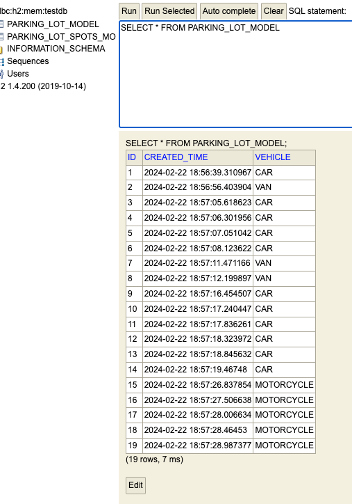
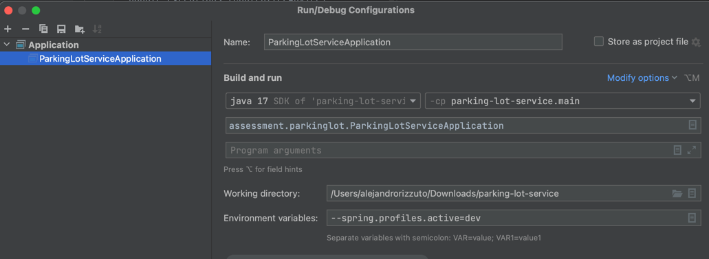
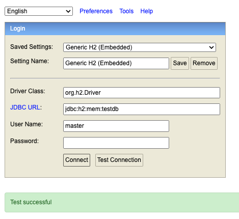
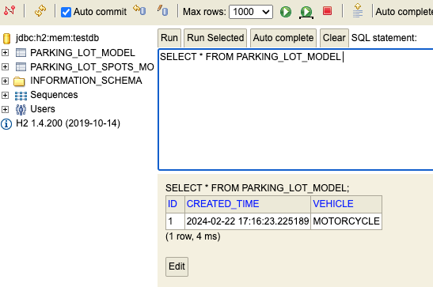
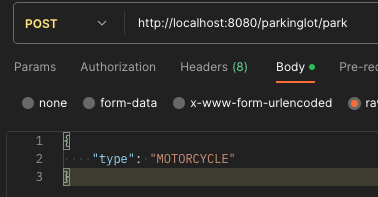

# Changelog

## [0.0.4] - 2024-02-22 20:20
### Added
- Fix in logic
- 18 tests
- controller tests
- service tests

## [0.0.3] - 2024-02-22 17:30
### Added
- H2 activation
- Enable repositories
- Creating repository
- Perform free spaces calculus

## [0.0.2] - 2024-02-22 16:20
### Added
- Controller, Service
- Validation
- POST mapping
- Exceptions
- Steps to perform the task

## [0.0.1] - 2024-02-22 14:47
### Added
- First commit
- Zip file added to github repository
